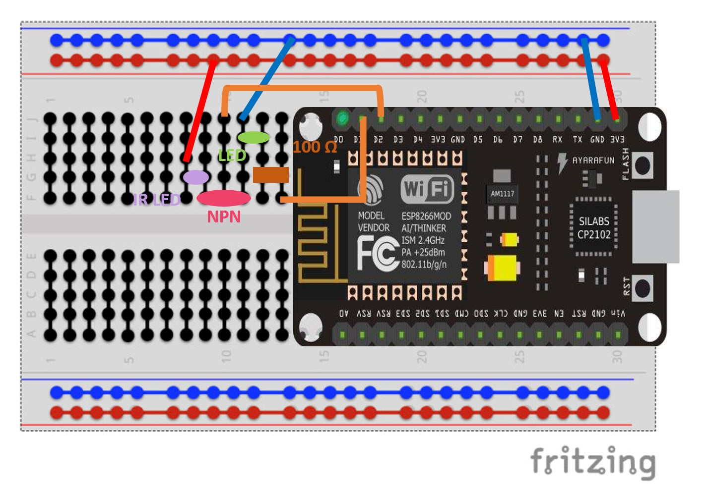
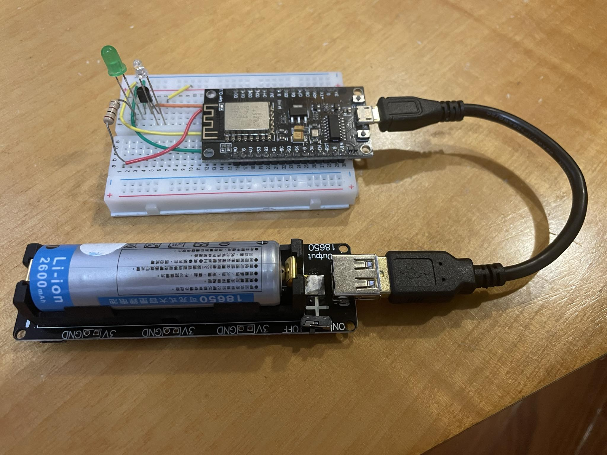

# ArduinoHub
## BlinkOuterLED

## DaikinAirConditioner
### TurnOnOffDaikinAC
* [Reference wiring](https://github.com/crankyoldgit/IRremoteESP8266/wiki#ir-sending)

* IR LED
* NPN transistor (2N2222A)

### TurnOnOffDaikinACByWifi

* Powered by lithium battery (18650)

## FirstServer
* [Reference](https://blog.jmaker.com.tw/esp8266-esp01/)